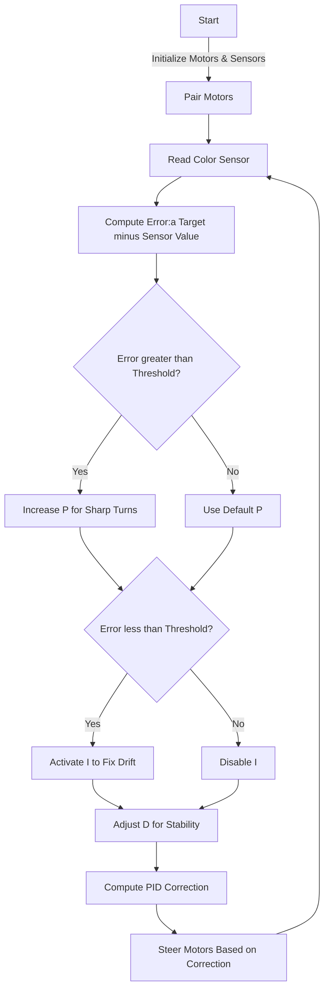

# Adaptive PID Line Following Flowchart

This diagram shows how the adaptive PID algorithm dynamically adjusts the robot's movement.

```mermaid
graph TD
    A[Start] -->|Initialize Motors & Sensors| B[Pair Motors]
    B --> C[Read Color Sensor]
    C --> D[Compute Error:a Target minus Sensor Value]
    D --> E{Error greater than Threshold?}
    E -- Yes --> F[Increase P for Sharp Turns]
    E -- No --> G[Use Default P]
    F & G --> H{Error less than Threshold?}
    H -- Yes --> I[Activate I to Fix Drift]
    H -- No --> J[Disable I]
    I & J --> K[Adjust D for Stability]
    K --> L[Compute PID Correction]
    L --> M[Steer Motors Based on Correction]
    M --> C
```
