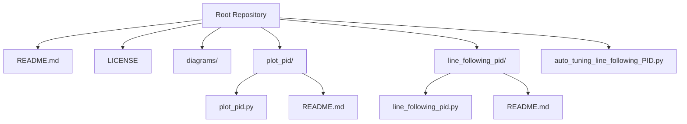

# Repository Structure Diagram

This diagram shows how the files in this repository are organized.

```mermaid
graph TD
    A[Root Repository] --> B[README.md]
    A --> C[LICENSE]
    A --> D[diagrams/]
    A --> E[plot_pid/]
    A --> F[line_following_pid/]
    A --> G[auto_tuning_line_following_PID.py]

    E --> E1[plot_pid.py]
    E --> E2[README.md]

    F --> F1[line_following_pid.py]
    F --> F2[README.md]
```
